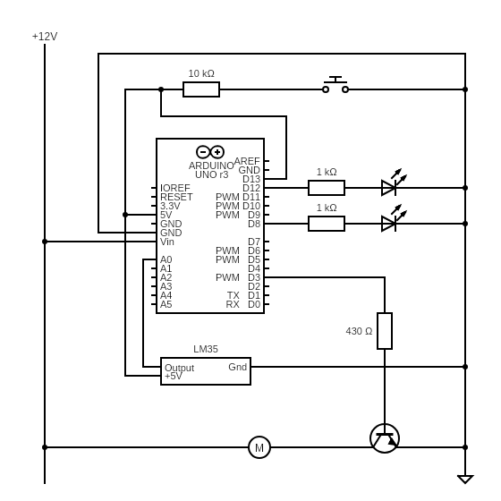

# Intelligent-Fan

This project is to create an intelligent temperature controlled personal fan using an Arduino Uno and a 3-pin 140mm computer fan.

## Parts list

* Arduino Uno

* 3-pin 140mm computer fan

* LM35 temperature sensor

* BC108 transistor

## Circuit diagram

